Introduccion:

El presente proyecto tiene como propósito analizar el mercado actual de
las aplicaciones nutricionales con el fin de comprender sus
características, fortalezas y debilidades, así como las necesidades
reales de los usuarios. En la actualidad, las aplicaciones de nutrición
representan una herramienta clave para mejorar los hábitos alimenticios
y el bienestar general, sin embargo, muchas presentan limitaciones en
personalización, simplicidad o utilidad práctica.\
Para desarrollar una propuesta más completa, se investigaron tres
aplicaciones reconocidas ---Lose It!, Noom y Lifesum--- evaluando sus
funcionalidades, experiencia de usuario, modelo de negocio y
características innovadoras. Además, se diseñó y aplicó una encuesta
dirigida a usuarios potenciales para identificar sus preferencias,
principales dificultades con las apps existentes y las funciones más
valoradas.

Objetivos

Analizar y comparar las principales aplicaciones nutricionales
existentes para identificar las funcionalidades más valoradas por los
usuarios y detectar áreas de oportunidad que permitan diseñar una
aplicación innovadora y eficiente.

1.  Evaluar las características, fortalezas y debilidades de tres
    aplicaciones líderes en el mercado: Lose It!, Noom y Lifesum.

2.  Determinar las preferencias, problemas y expectativas de los
    usuarios mediante una encuesta estructurada.

3.  Identificar las funcionalidades y elementos de diseño más apreciados
    por los usuarios en las aplicaciones nutricionales.

4.  Proponer oportunidades de mejora e innovación que integren
    personalización, simplicidad y educación nutricional en una sola
    plataforma.

5.  Establecer una base conceptual para el desarrollo de Nutri-Track,
    considerando los resultados del análisis y las respuestas de los
    usuarios.

Metodologias

-   Las herramientas que fueron usadas para realizar esta investigacion
    fue consultar las distintas aplicaciones elegidas como principal
    Fuente de ideas

-   Realizar encuestas tomando en cuenta las necesidades vitales oara el
    usuario y realizarlas a distnitos usarios de diferentes tipos de
    entornos desde las edades de 18 años en Adelante

-   Tomando en cuenta estos datos fue elaborada un plan principal para
    nuestro Proyecto y el como se espera que funcione tomando en cuenta
    los datos recopilados de las aplicaciones y los datos que fueron
    tomados en las encuestas realizdas

Analisis de Aplicaciones

### 1. Lose It!

-   **Funcionalidades Principales**:

Registro de alimentos y calorías (amplia base de datos), registro de
ejercicio, seguimiento de macros (proteínas, carbohidratos, grasas),
seguimiento de nutrientes, establecimiento de objetivos de peso.

-   **Experiencia de Usuario**:

Fácil de usar y rápido, con una interfaz limpia. El escáner de código de
barras es un punto destacado para el registro de alimentos. Diseño
enfocado en la simplicidad y la visualización clara de calorías.

-   **Modelo de Negocio**:

1.  **Freemium**. La versión gratuita permite el seguimiento básico de
    calorías y alimentos.

2.  **Premium.** La version desbloquea funciones avanzadas como el
    seguimiento de nutrientes específicos, planificación de comidas,
    conexión con más dispositivos/apps, y retos.

- 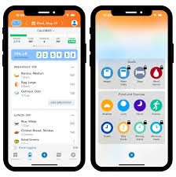
   
**Puntos Fuertes:**

1.  Base de datos de alimentos extensa y precisa.

2.  Interfaz sencilla y rápida para el registro diario.

3.  Escáner de código de barras eficiente.

-   **Puntos Débiles**:

1.  Algunas funciones importantes (macros, seguimiento detallado)
    requieren la suscripción Premium.

2.  El enfoque principal es el conteo de calorías, lo que puede ser
    limitante para algunos usuarios.

-   **Características Innovadoras**:

Conexión con rastreadores de fitness. La capacidad de \"Snap It\"
(registrar alimentos tomando una foto) aunque no es única, busca
simplificar aún más el proceso de registro.

### 2. Noom

-   **Funcionalidades Principales**:

1.  **Entrenamiento personalizado** y coaching (humano), seguimiento de
    alimentos

2.  **Enfoque psicológico** (clasificación de alimentos por colores:
    verde, amarillo, rojo), seguimiento de ejercicio, lecciones diarias
    basadas en la ciencia del comportamiento.

-   **Experiencia de Usuario**:

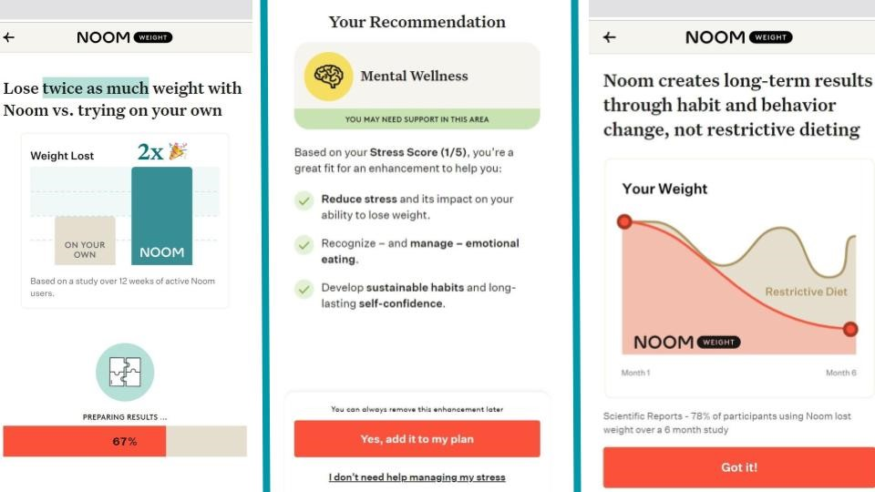
Enfocada en la educación y el cambio de
comportamiento a largo plazo. La interfaz es intuitiva, pero la
experiencia se basa en la interacción con el coach y el contenido
diario, lo que la hace más intensiva que una simple aplicación de
registro.

-   **Modelo de Negocio**, **De Pago (Suscripción)**:

Ofrece una prueba gratuita, pero el programa completo con acceso al
coach personal y los planes de estudio es de suscripción. Su precio
suele ser significativamente más alto que el de las aplicaciones de
conteo de calorías.

-   **Puntos Fuertes**:

1.  Enfoque en la psicología del comportamiento y la creación de hábitos
    duraderos.

2.  Acceso a coaches personales (soporte humano).

3.  Adecuada para personas que buscan entender *por qué* comen y cambiar
    su mentalidad.

-   **Puntos Débiles**:

1.  Alto coste de la suscripción.

2.  Puede sentirse lento para usuarios que solo quieren una herramienta
    de registro rápido.

3.  La eficacia depende de la motivación del usuario para seguir el plan
    de estudios y la interacción con el coach.

-   **Características Innovadoras**

La integración de la ciencia del comportamiento y el coaching humano en
una plataforma digital es su principal diferenciador. Su sistema de
clasificación de alimentos por colores ayuda a entender la densidad
calórica y a tomar mejores decisiones.

### 3. Lifesum

-   **Funcionalidades Principales**:

1.  Registro de alimentos y hábitos (agua, frutas, verduras), amplia
    base de datos, planes de comidas y dietas predefinidas (Keto,
    Mediterránea, Ayuno Intermitente, etc.), seguimiento de ejercicio,

2.  Life Score para evaluar la calidad de la dieta.

-   **Experiencia de Usuario**

Diseño atractivo y muy visual, con una interfaz moderna y colorida. Es
fácil de navegar y el registro se simplifica con el escáner de código de
barras y los accesos rápidos. Se centra en hacer que la alimentación
saludable sea simple.

-   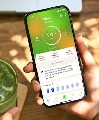
    **Modelo de Negocio**

1.  **Freemium**. La versión gratuita permite el registro básico.

2.  **Premium** desbloquea todos los planes de dietas y comidas
    detallados, análisis nutricionales avanzados, Life Score™ y más
    bases de datos de alimentos.

-   **Puntos Fuertes**

1.  Variedad de planes de dietas y recetas para diferentes estilos de
    vida.

2.  Diseño agradable y motivador.

3.  Herramientas para creación de hábitos (seguimiento de agua y
    porciones de frutas/verduras).

-   **Puntos Débiles**

1.  El acceso a la mayoría de los planes de comidas populares y
    herramientas de apoyo es de pago.

2.  Algunos usuarios encuentran el escáner de código de barras menos
    robusto que el de otros competidores.

-   **Características Innovadoras**

Life Score™ (una métrica para evaluar la calidad general de tu dieta) y
sus planes de comidas personalizadas basadas en objetivos y preferencias
dietéticas específicas. Simplificación del registro de hábitos con
contadores de un solo toque.

####### Tabla comparativa de Aplicaciones
| Característica | **Lose It!** | **Noom** | **Lifesum** |
|:----------------|:-------------|:----------|:-------------|
| **Enfoque Principal** | Conteo de calorías y macros | Psicología del comportamiento | Calidad de dieta y planes visuales |
| **Funcionalidades Clave** | Registro de alimentos, escáner, seguimiento de macros | Coaching humano, clasificación por colores | Planes de comidas, Life Score |
| **Experiencia de Usuario** | Interfaz limpia y rápida | Enfocada en la educación y hábitos | Atractiva, moderna y visual |
| **Modelo de Negocio** | Freemium | Suscripción | Freemium |
| **Punto Fuerte** | Base de datos precisa y velocidad | Coaching y cambio de hábitos | Variedad de planes y diseño |
| **Punto Débil** | Funciones Premium limitadas | Alto costo | Planes avanzados de pago |
| **Innovación Destacada** | “Snap It” y conexión fitness | Psicología aplicada y colores | “Life Score™” personalizado |

# Encuesta Realizada a los Usuarios 

1.  ¿Qué aplicación utilizas actualmente para seguimiento nutricional o
    de peso? \*

-   MyFitnessPal

-   Fat Secret u otra similar

-   Noom

-   Lifesum u otra de hábitos.

-   Ninguna

-   Esta pregunta es muy importante para usar las aplicaciones que usen
    mas comunmente los usuarios darnos una idea de la funcionalidad mas
    util y en caso de que haya otras aplicaciones poder darnos una vista
    mas amplia de que asi fuera

-   

2.  ¿Cuál es tu principal objetivo de salud/nutrición? \*

-   Pérdida de peso o composición corporal.

-   Mejorar energía y bienestar general.

-   Manejar o prevenir una condición de salud específica.

-   Esta pregunta es importante para tener mas enfoque en cuanto a el
    uso que le da el usuario a las aplicaciones nutricionales

-   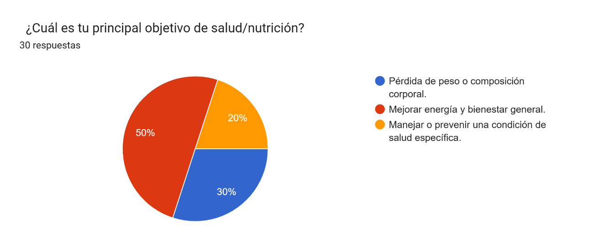

3.  ¿Qué tan importante es para ti hacer seguimiento detallado de
    Macronutrientes (Proteínas, Carbs, Grasas)? \*

-   Muy importante

-   Algo importante

-   Poco importante

-   Esta pregunta fue realizada para entender que tan importante es este
    aspecto para el usuario

-   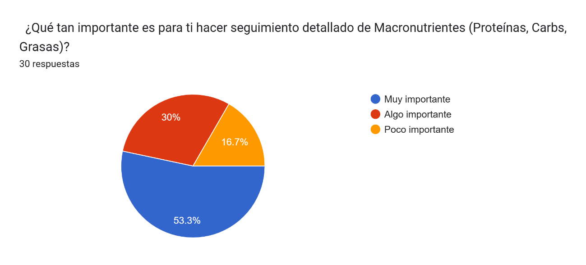

4.  ¿Qué tan importante es para ti hacer seguimiento de Micronutrientes
    (Vitaminas y Minerales)? \*

-   Muy importante

-   Algo importante

-   Poco importante

-   Esta pregunta fue realizada para entender que tan importante es este
    aspecto para el usuario

-   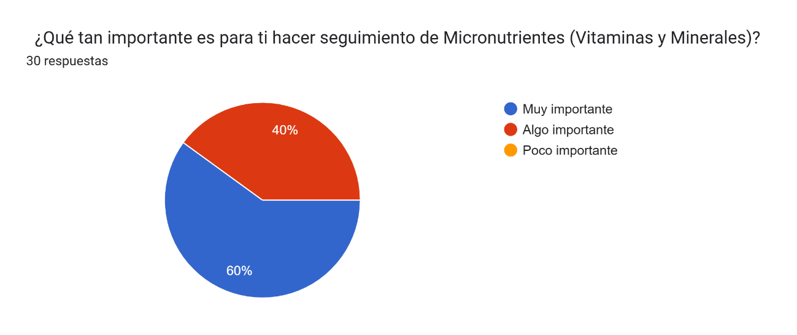

5.  ¿Preferirías una aplicación que se centre en\...? \*

-   Solo en el registro de alimentos (Diario calórico).

-   Solo en el aprendizaje de hábitos (Guías y lecciones).

-   Ambos aspectos por igual.

-   Esta pregunta fue realizada para darle el tema central o mas
    importante

-   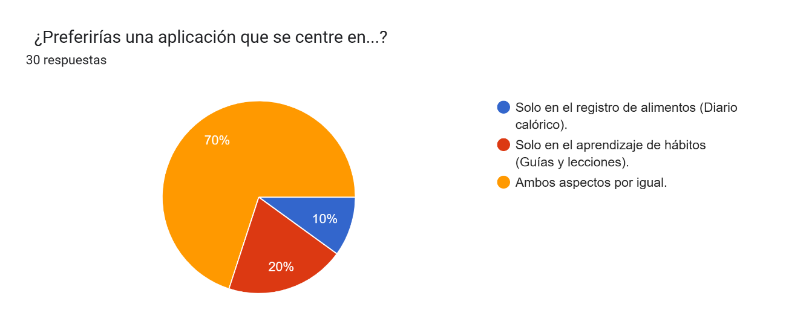

6.  De las siguientes funciones, ¿cuál te resulta más útil? \*

-   Escáner de código de barras y registro rápido.

-   Recetas personalizadas y planes de comidas.

-   Gráficos de progreso y contenido educativo.

-   Esta pregunta fue realizada para saber que idea le parece mas
    atractiva al usuario en cuanto a graficas para que la aplicacion no
    parezca "aburrida" o poco intereante

-   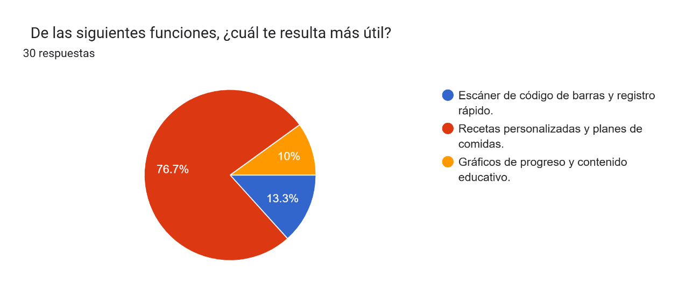

7.  ¿Usarías una sección de \"Comunidad\" para compartir recetas y
    recibir apoyo de otros usuarios? \*

-   Sí, definitivamente.

-   Tal vez, si fuera fácil de usar.

-   No, prefiero usar la aplicación en privado.

-   Esta pregunta fue realizada basandonos en una idea personal de la
    seccion "Comunidad" y si esto es atractivo a el usuario

   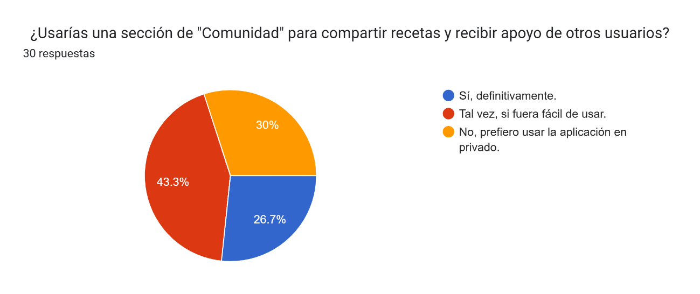

8.  ¿Cuál es el factor más frustrante que has encontrado en otras
    aplicaciones de nutrición?

-   La base de datos de alimentos es incompleta o inexacta.

-   Es muy lenta o complicada de usar y registrar.

-   La personalización no se ajusta a mis necesidades reales.

-   Esta pregnta fue realizada para que las dificultades encontradas en
    otras aplicaciones no se repitan en la nuestra aplicacion

-   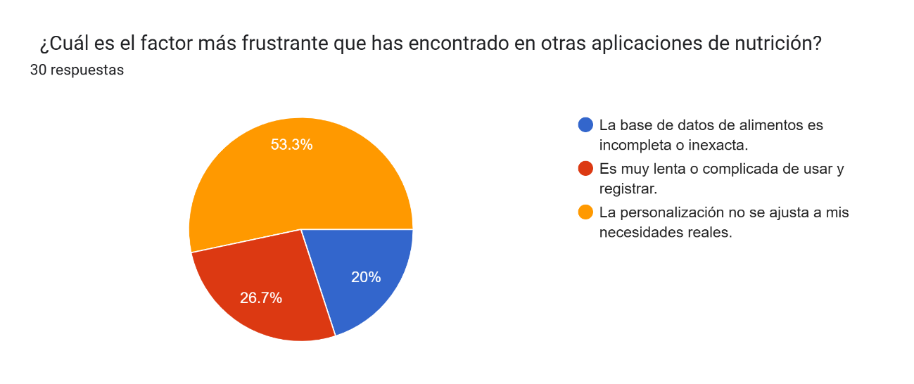

9.  Si la aplicación recomienda una receta, ¿qué factor consideras el
    más importante?

-   Que sea rápida y fácil de preparar.

-   Que tenga un alto contenido de proteínas.

-   Que utilice ingredientes básicos.

-   Esta pregunta fue realizada para que el usuario nos diera una guia
    de que tipo de recetas les resultan mas atractivas o motivadoras
    para realizar en casa y por su cuenta propia

-   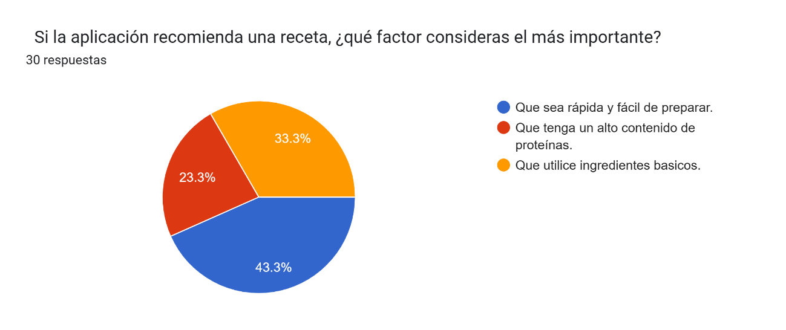

10. ¿Qué tipo de seguimiento de progreso te motiva más? \*

-   Gráficos de evolución de peso.

-   Gráficos de la composición de tu dieta (ej. macros).

-   Gráficos del cumplimiento de hábitos (ej. agua, ejercicio).

-   Esta pregunta fue realizada para colocar el tipo de graficos que le
    parezcan mas llamativos al usuario y asi tener una motivacion
    constante

-   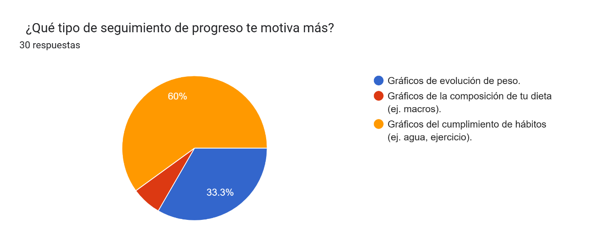

11. Al registrar tus alimentos, ¿qué tipo de unidad de medida prefieres
    usar?

-   Gramos o mililitros

-   Medidas caseras

-   Porciones

-   Esta pregunta fue realizada para tener la idea clara o base de lo
    que el ususario comprende mas facilmente las medidas en cuanto a
    alimentos para aplicarlos en la aplicacion

-   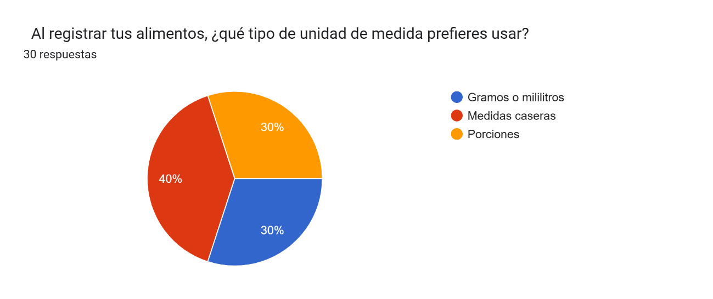

**RESUMEN DE LO QUE LOS USUARIOS BUSCAN EN UNA APLICACIÓN:**

1.  **Simplicidad y personalización.**\
    Muchos se quejan de que las apps existentes son complicadas o no se
    ajustan a sus necesidades reales. Quieren algo fácil, rápido y
    adaptado a su tipo de dieta o rutina.

2.  **Recetas prácticas y personalizadas.**\
    La mayoría considera más útil tener **recetas** adaptadas (fáciles,
    con ingredientes básicos y alto valor proteico) antes que funciones
    complejas.

3.  **Seguimiento equilibrado.**\
    Prefieren una app que combine registro de alimentos y hábitos
    saludables (no solo contar calorías).

4.  **Motivación visual.**\
    Los usuarios se motivan más con gráficos de progreso visuales,
    especialmente de peso o cumplimiento de hábitos.

5.  **Privacidad.**\
    Varios no quieren usar funciones de comunidad; prefieren
    experiencias individuales.

6.  **Unidades simples.**\
    Prefieren medidas caseras o porciones, no gramos exactos.

# Perfil de Aplicación Futura 

**Audiencia**: Personas que buscan mejorar hábitos alimenticios,
alcanzar objetivos de peso mayores de 16 años y menores de 60 (pérdida,
mantenimiento, ganancia de masa muscular) y hacer seguimiento detallado
de su ingesta nutricional. Incluye usuarios principiantes (enfocados en
la formación de hábitos básicos y educación) e intermedios/avanzados
(enfocados en la precisión de macronutrientes y micronutrientes).

**Propuesta de Valor**: Plataforma todo-en-uno que combina el
seguimiento granular de nutrientes (macro y micronutrientes) con el
enfoque en la formación de hábitos sostenibles y la personalización
dinámica de planes de comidas. Se destaca la conexión entre el registro
de alimentos y las lecciones de *coaching* para una educación práctica
en tiempo real.

# Módulos y Características Principales

**Datos del Usuario**: Edad, sexo, altura, peso actual. Usado para
calcular el Gasto Energético Total (GET).

**Cálculo del Gasto Energético Total (GET):** Uso de fórmulas
científicamente validadas con ajuste por nivel de actividad.

**Peso Objetivo Ideal:** Se pide al usuario que defina un peso meta y un
*marco de tiempo* realista para alcanzarlo.

**Objetivos de Salud**, Meta (perder, mantener, ganar peso/músculo).
Generación de objetivo calórico y de macronutrientes diario.

**Tarjeta de Salud (Historial Médico y Hábitos)**,
Alergias/Intolerancias, Condiciones Médicas, Preferencias Dietéticas,
Nivel de Actividad Física.,

**Historial de Medicamentos:** Para identificar interacciones o efectos
conocidos en el apetito/metabolismo que puedan afectar la planificación.

**Seguimiento de Progreso**, Gráficos de evolución: peso, mediciones
corporales, cumplimiento calórico y de hábitos.

**Métricas Subjetivas:** Se añade un medidor diario de Estado de Ánimo
(mood), Niveles de Energía y Calidad del Sueño

# Plan base para el proyecto: 

# Módulo de Medidores de Alimentos (Diario)

**Comidas Frecuentes:** Guardar comidas completas o alimentos comunes
como \"favoritos\" para un registro instantáneo.

**Calorías (Energía)**, Seguimiento del consumo diario vs. la meta.

**Registro de Consumo de Agua:** Meta diaria de hidratación con
recordatorios personalizables.

**Macronutrientes**: Gráfico de barras/pastel comparando Carbohidratos,
Proteínas y Grasas con las metas del usuario (en gramos y porcentaje).
**Desglose de Carbohidratos:** Distinción entre carbohidratos netos
(opcional para dietas cetogénicas o bajas en carbohidratos).

**Micronutrientes**: Seguimiento de vitaminas y minerales clave. La app
no solo alerta por deficiencia, sino también por exceso (ej. Vitamina A,
Sodio) para prevenir toxicidad.

**Vista de Semáforo:** Los nutrientes se muestran en verde (cumplido),
amarillo (cerca de la meta) o rojo (bajo/alto).

**Detalles**, Seguimiento de: Fibra, Azúcares (añadidos y totales),
Sodio y Colesterol. Alcohol, Inclusión del registro de consumo de
alcohol, calculando su aporte calórico y su impacto en el balance
nutricional.

# Módulo de Recetas y Contenido

**Recetas y Menús**, Base de datos con filtros: tiempo de preparación,
calorías, dieta

**Generador de Plan de Comidas:** Crea menús semanales automáticos
basados en los objetivos calóricos y las preferencias de la Tarjeta de
Salud.

**Guía Personalizada y Coaching**

**Comunidad, Foro y Grupos de Apoyo**: Espacio para compartir (recetas,
éxitos, desafíos) con moderación activa.

**Grupos Temáticos:** Posibilidad de unirse a grupos específicos (ej.
\"Padres que cocinan saludable\", \"Entrenamiento de fuerza y macros\").

**Reconocimientos:** Badges y logros por consistencia y participación
positiva.

# Módulo Informativo

**Acerca de y Legal**, Información de Misión/Visión, Equipo, Política de
Privacidad, Términos de Uso

**Seguridad de Datos:** Énfasis en cómo se manejan y protegen los datos
de salud sensibles (cumplimiento de GDPR, HIPAA u otras normativas
locales relevantes).

**Descargo de Responsabilidad (Disclaimer)**: Claro y visible: La
aplicación es una herramienta de apoyo digital y no sustituye la
consulta, el diagnóstico o el tratamiento proporcionado por un
profesional de la salud con licencia (Nutriólogo, Médico, Psicólogo). Se
recomienda encarecidamente la consulta profesional antes de iniciar
cualquier cambio significativo en la dieta o estilo de vida.
