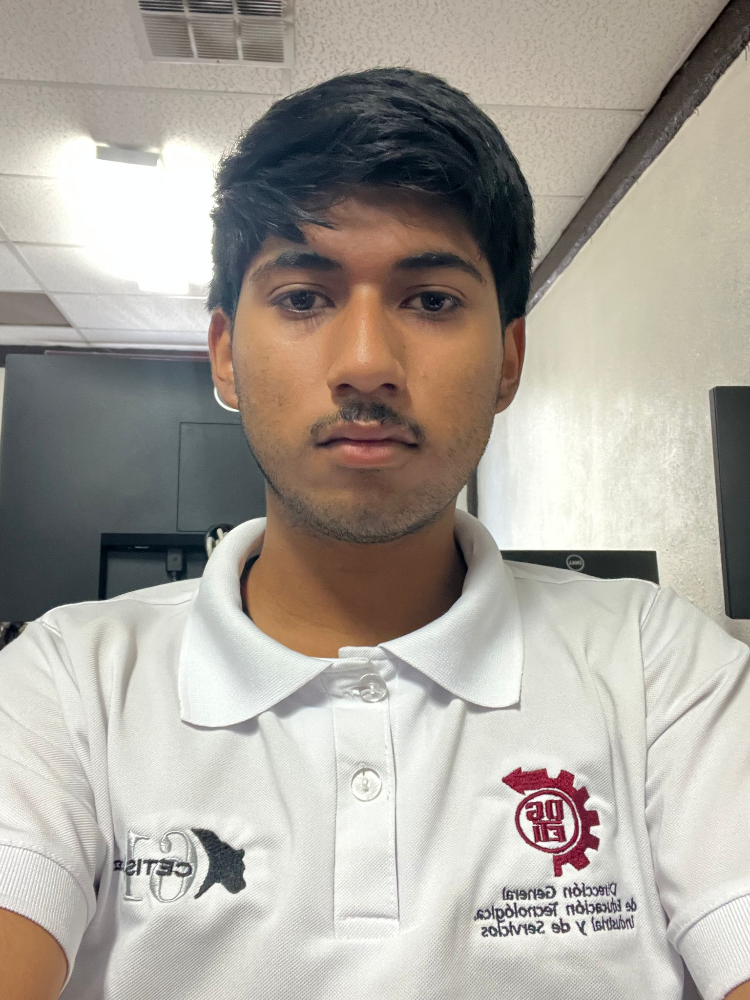

# Documentacion de la aplicacion
## Proyecto Final 
  1.  Objetivo
  2.  Integrantes
  3.  Analisis de la base de datos
   
## Objetivo
El objetivo de este proyecto es aprender el uso de las APIs nutricionales y adaptarlas a nuestros programas 

## Integrantes
### Integrante 1: 
1. Nombre: Omar Daniel Ortega Valtierra
2. Numero control: 23308060610674
3. Correo electronico: 23308060610674@cetis61.edu.mx
4. Grupo:5D
5. Especialidad: Programacion
6. Institucion: CETis 61
7. 
### Integrante 2:
1. Nombre: Miguel Angel Roman Padilla 
2. Numero control: 23308060610314
3. Correo electronico:  23308060610314@cetis61.edu.mx
4. Grupo:5D
5. Especialidad:Programacion
6. Institucion: CETis 61
7. 

  
 
## Analisis de la Base de Datos 

